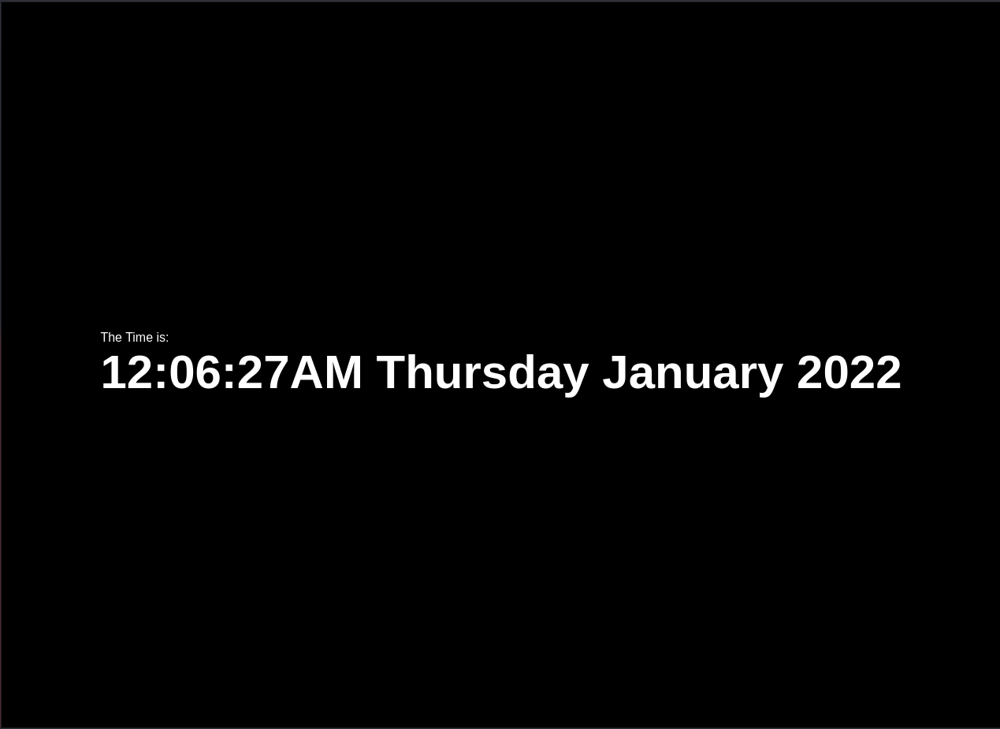

<h1 align="center">
  <a href="https://samucatezu.github.io/jsClock/">Site do programa :alarm_clock: </a>
</h1>

<h1 align="center">
  
</h1>

 

## 🚀 Tecnologias
Projeto desenvolvido com as seguintes tecnologias:

- CSS
- HTML5
- JavaScript: getHours, getMinutes, getSeconds, getDay, toLocaleString, getFullYear

## 💻 Projeto

Um projeto simples para entender e obter mais conhecimento sobre JavaScript e suas funcionalidades.
